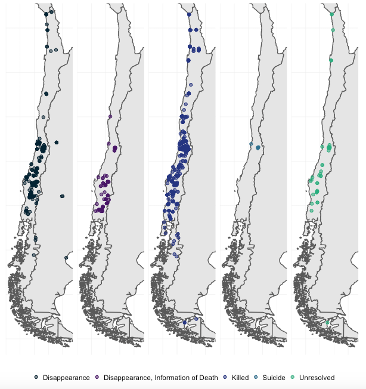

## The `pinochet` R package

The `pinochet` package contains data about 2,398 cases of human rights abuses in the Pinochet regime in Chile (1973-1990). It features 59 variables describing the victims' individual characteristics, as well as information about the perpetrators and latitude and longitude coordinates to the locations where the atrocities took place. The original source of information is the Report of Chilean National Commission on Truth and Reconciliation (2 vols), published in 1991. The dataset accompanies the article [Deaths and Disappearances in the Pinochet Regime: A New Dataset](https://osf.io/rm4y8) by [Danilo Freire](http://danilofreire.github.io), [John Meadowcroft](http://johnmeadowcroft.net), [David Skarbek](http://davidskarbek.com), and Eugenia Guerrero. 

## Installation

`pinochet` can be installed by running: 

```{r eval = FALSE}
install.packages("pinochet")
```

And then loaded with:
```{r eval=FALSE}
library(pinochet)
data(pinochet)
```

## Examples

It is very easy to make summaries, plots and maps with `pinochet`. For instance, one can check the number of victims that suffered different types of violence with the following code:

```{r table-noeval, message=FALSE,warning=FALSE,eval=FALSE}
# Load or install required packages
if (!require("tidyverse")) {
        install.packages("tidyverse")
}
if (!require("kableExtra")) {
        install.packages("kableExtra")
}
# Load pinochet
library(pinochet)
data("pinochet")

# Table
kable(table(pinochet$violence), "html", caption = "Number of killings, disappearances, unresolved cases, and suicides", col.names = c("Violence", "N")) %>%
  kable_styling(position ="center")
```

```{r table, echo=FALSE,warning=FALSE,message=FALSE}
library(pinochet)
data("pinochet")
library(kableExtra)
library(tidyverse)
kable(table(pinochet$violence), "html", caption = "Number of killings, disappearances, unresolved cases, and suicides", col.names = c("Violence", "N")) %>%
  kable_styling(position ="center")
```


Users can also plot time trends of variables of interest. The graph below shows the total number of human rights abuses in the regime.

```{r trend-noeval, message=FALSE,warning=TRUE,eval=FALSE}
# Load or install required packages
if (!require("tidyverse")) {
        install.packages("tidyverse")
}
if (!require("lubridate")) {
        install.packages("lubridate")
}

# Plot graph
pinochet %>% ungroup() %>% 
  mutate(Year = year(start_date_monthly)) %>%
  group_by(Year) %>% tally() %>% 
  filter(!is.na(Year)) %>% 
  ggplot(aes(x = Year, y = n)) +
  geom_line() +
  theme_minimal() +
  labs(x = NULL, y = NULL, title = "Number of Human Rights Abuses", 
       subtitle = "Pinochet Regime, 1973-1990") +
  scale_y_continuous(breaks = c(0, 500, 1000, 1274))
```

```{r trend, message=FALSE,warning=TRUE,echo=FALSE}
library(tidyverse)
library(sf)
library(lubridate)

pinochet %>% ungroup() %>% 
  mutate(Year = year(start_date_monthly)) %>%
  group_by(Year) %>% tally() %>% 
  filter(!is.na(Year)) %>% 
  ggplot(aes(x = Year, y = n)) +
  geom_line() +
  theme_minimal() +
  labs(x = NULL, y = NULL, title = "Number of Human Rights Abuses", 
       subtitle = "Pinochet Regime, 1973-1990") +
  scale_y_continuous(breaks = c(0, 500, 1000, 1274))
```

Since the `pinochet` package also includes georeferrenced data, it is easy to create maps with coordinates of latitude and longitude. Here, we show where the location of the victims when they were first targeted.

```{r maps-noeval, eval=FALSE, warning=FALSE, message=FALSE, fig.align='center', fig.cap="Spatial variation in human rights abuses in the Pinochet regime, 1973-1990"}
# Load or install required packages
if (!require("sf")) {
        install.packages("sf")
}
if (!require("devtools")) {
        install.packages("devtools")
}
if (!require("rnaturalearthhires")) {
        install.packages("rnaturalearthhires", repos = "http://packages.ropensci.org", type = "source")
}

# Use devtools to install rnaturalearthdata
devtools::install_github("ropensci/rnaturalearthdata")
library(rnaturalearthdata)

# Some data wrangling before plotting
chile <- rnaturalearthhires::countries10 %>%
st_as_sf() %>%
filter(SOVEREIGNT %in% c("Chile", "Argentina", "Peru", "Paraguay"))

# Add coordinates of latitude and longitude
violent_events <- pinochet %>% 
  select(violence, latitude_1, longitude_1) %>%
  filter(!is.na(latitude_1), !is.na(longitude_1), !is.na(violence)) %>%
  st_as_sf(coords = c("longitude_1", "latitude_1"), crs = 5361)

coords_vio <- st_coordinates(violent_events) %>% as_tibble()
violent_events <- bind_cols(violent_events, coords_vio)

# Plot
ggplot() +
  geom_sf(data = chile) +
  coord_sf(xlim = c(-75.6, -67), ylim = c(-55, -19)) +
  labs(x = NULL, y = NULL) +
  geom_point(data = violent_events, aes(x = X, y = Y, colour = violence, fill = violence), shape = 21) + 
  scale_colour_manual(values = c("#042333FF", "#481567FF",  "#253582FF", "#2D708EFF", "#29AF7FFF")) +
  scale_fill_manual(values = alpha(c("#042333FF", "#481567FF", "#253582FF", "#2D708EFF", "#29AF7FFF"), .6)) +
  facet_wrap(~violence, nrow = 1) +
  theme_minimal() +
  theme(strip.text = element_blank()) +
  theme(legend.position = "bottom",
        axis.text = element_blank()) + 
  theme(legend.title=element_blank())
```



## Citation

If you find the dataset useful, please consider citing the article and the R package as follows:

```
@misc{freire2019deaths,
  title={{Deaths and Disappearances in the Pinochet Regime: A New Dataset}},
  author={Freire, Danilo and Meadowcroft, John and Skarbek, David and Guerrero, Eugenia},
  howpublished = {\url{https://osf.io/vqnwu}},
  publisher={Open Science Framework},
  year={2019},
  month={May}
}

@manual{freire2019pinochet,
  title={\texttt{pinochet}: Data about the victims of the Pinochet regime, 1973-1990},
  author={Freire, Danilo and Mingardi, Lucas and McDonnell, Robert},
  year={2019},
  note={R package version 0.1},
  url={https://CRAN.R-project.org/package=pinochet}
}
```

